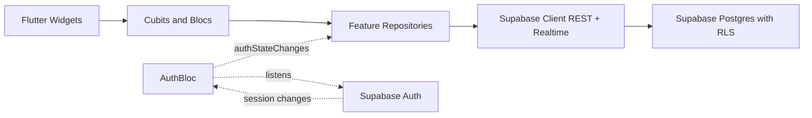

## Decisions locked in

- **Backend**: Supabase (Postgres + RLS + Auth + Storage + Edge Functions). Free tier indefinitely at small scale. `pg_dump` exits when needed.
- **Auth**: Magic-link primary (right for this audience: older / cognitively-loaded caregivers), Google OAuth secondary, **Apple Sign-In tertiary (mandatory on iOS per App Store Guideline 4.8 because Google Sign-In is offered)**. No email/password.
- **State management**: `flutter_bloc`. Cubit by default; full `Bloc` for `AuthBloc` (genuine state machine: signedOut / sendingLink / linkSent / signedIn / refreshing / expired). Pattern is portable even if the library died.
- **Platforms v1**: **iOS + Android native only.** Web is not a v1 target (existing web-conditional code stays in place via conditional imports — `main.dart`'s `usePathUrlStrategy`, the `lightbox_history_bridge_web.dart`, the `kIsWeb` checks. They're harmless if web isn't built and cheap to keep around in case web is revisited.) Desktop folders (`macos/`, `windows/`, `linux/`) left auto-generated, untouched, untested.
- **Monetization v1**: none. No Stripe, no ad SDK, no payment abstraction, no token system, **no donate link either** — Apple's policy on developer tips/donations is gray enough that it's not worth the App Store review risk pre-launch. Add monetization in v1.1 after launch with a deliberate strategy. (Articles content type + AdSlot widget + affiliate links explicitly deferred to v2.)

## Mobile-native implications (read this before approving)

Going native iOS + Android instead of web introduces real prerequisites and costs that are not engineering work but block progress:

- **Apple Developer Program: $99/year.** Required to run on a real iPhone (beyond a 7-day dev cert), to enable Sign In with Apple capability, and to submit to the App Store. Sign up at [developer.apple.com](https://developer.apple.com/programs/).
- **Google Play Console: $25 one-time.** Required to submit to Play Store. Sign up at [play.google.com/console](https://play.google.com/console/signup).
- **Google Cloud Console OAuth setup.** Create OAuth 2.0 client IDs for iOS (bundle ID) and Android (package name + SHA-1 release fingerprint). Add Supabase project's auth callback as authorized redirect.
- **Apple Sign-In capability** must be enabled in Xcode under Signing & Capabilities. Requires the Apple Developer account above.
- **Privacy policy URL** required by both stores at submission time. (Not v1 dev-time blocker, but eventual.)
- **App Tracking Transparency** disclosure in `Info.plist` (`NSUserTrackingUsageDescription`) — only if you ever add analytics that track across apps. For v1 we add nothing, so this is just a "don't accidentally add Firebase Analytics" reminder.
- **Deep linking is now load-bearing.** Magic-link emails contain a URL the user clicks on their phone. That URL must open the app, not a browser. Custom URL scheme (`flutterposts://auth-callback`) is the simpler approach for v1; Universal Links / App Links (verified `https://flutterposts.app/auth/...`) is the polished version for v2.
- **Future monetization will use IAP, period.** Any subscription, "remove ads" upgrade, premium feature, or even developer tips on iOS/Android must use Apple IAP / Google Play Billing (15-30% take). Stripe is for off-app web purchases only. This is the conversation from earlier — it now applies to you for real once you ship native.

## Why these are correct for your case

- Audience is parents of people with disabilities. AdSense at solo-dev scale serves junk ads on emotional content; direct-sold endemic ads need a sales team you don't have. Affiliate-in-curated-articles is the long-term lever, but it needs an articles content type that's a v2 problem.
- Magic-link auth reduces password recovery / brute-force / storage surface area to near zero, and respects the audience.
- flutter_bloc's pattern is `sealed Event` + `sealed State` + `Stream<State>` — replaceable by ~100 lines of `dart:async` if the lib ever dies. Matches your C++/Windows-service explicitness preference.
- Supabase Auth has Google OAuth + magic link built in. RLS does row-level security in Postgres (no separate authz service). `pg_dump` portability is real.

## Architecture




Rule: widgets never call repositories directly. Widgets dispatch to cubits/blocs; cubits/blocs call repositories; repositories call Supabase. Everything testable with fakes.

## Directory restructure (kill the half-done split)

Current state is confused: `lib/src/views/` holds all real code, `lib/src/features/forum/` is empty aspiration, `lib/src/shared/` is a grab-bag. Move to feature-first vertical slicing — canonical flutter_bloc layout:

```text
lib/
├── main.dart                       # entry: bootstrap + runApp(MyApp)
├── src/
│   ├── app.dart                    # MaterialApp.router + MultiBlocProvider at root
│   ├── bootstrap.dart              # Supabase.initialize, env loading, BlocObserver
│   │
│   ├── core/                       # cross-feature only (renamed from 'shared/')
│   │   ├── env/                    # Env class, --dart-define wiring
│   │   ├── error/                  # AppError, mapSupabaseError()
│   │   ├── logging/                # AppBlocObserver
│   │   ├── navigation/             # lightbox controller + history bridge
│   │   ├── routing/                # app_router.dart, app_routes.dart
│   │   ├── theme/                  # existing theme/ folder
│   │   └── widgets/                # responsive_layout + shared atoms
│   │
│   └── features/
│       ├── auth/
│       │   ├── data/
│       │   │   └── auth_repository.dart      # wraps SupabaseClient.auth
│       │   ├── domain/
│       │   │   └── auth_user.dart            # plain Dart, no Supabase types leak
│       │   └── presentation/
│       │       ├── bloc/{auth_bloc,auth_event,auth_state}.dart
│       │       ├── auth_gate.dart            # routes to sign-in or shell
│       │       ├── sign_in_page.dart
│       │       └── magic_link_sent_page.dart
│       │
│       ├── forum/
│       │   ├── data/
│       │   │   ├── forum_repository.dart
│       │   │   └── models/                   # Post, Comment, Community
│       │   ├── domain/                       # mirrors data/models
│       │   └── presentation/
│       │       ├── shell/                    # forum_shell + drawer + sidebar + resources
│       │       ├── feed/
│       │       │   ├── cubit/feed_cubit.dart
│       │       │   ├── group_feed_page.dart
│       │       │   └── group_list.dart
│       │       ├── thread/
│       │       │   ├── cubit/thread_cubit.dart
│       │       │   └── thread_comments_page.dart
│       │       └── widgets/                  # media_viewer_dialog, etc.
│       │
│       └── me/
│           └── presentation/
│               ├── me_home_page.dart
│               └── me_settings_page.dart     # donate footer link here
```

Rules:

- `features/<x>/data/` is the only place that imports `supabase_flutter`.
- `features/<x>/domain/` types are plain Dart — no Supabase types leak into widgets or blocs.
- Cross-feature dependencies go through `core/` or another feature's repository, never reach-around into UI.
- Kill `lib/src/views/` entirely. Kill the empty `lib/src/features/forum/`. Kill the empty `lib/src/app.dart` (1-byte file) and replace with real version.

## Supabase schema (v1)

Six tables. Designed so `pg_dump` migrates to vanilla Postgres anywhere.

- `profiles` — one row per auth user. `id uuid` references `auth.users(id)`. Holds `display_name`, `avatar_url`, `created_at`. Auto-created by trigger on `auth.users` insert.
- `communities` — id, slug, name, description, created_by, created_at. Replaces the hardcoded groups in `GroupList`.
- `community_members` — composite PK (community_id, user_id), role, joined_at.
- `posts` — id, community_id, author_id, title, body, created_at, updated_at, deleted_at.
- `comments` — id, post_id, author_id, parent_comment_id (nullable for threading), body, created_at, deleted_at.
- `media` — id, owner_id, post_id (nullable), storage_path, mime_type, width, height, created_at. Backs the lightbox.

RLS policies:

- `profiles`: anyone authenticated can SELECT; only owner can UPDATE.
- `communities`: anyone authenticated can SELECT public communities; only authenticated users can INSERT.
- `posts` / `comments`: anyone authenticated can SELECT non-deleted rows; only author can INSERT / UPDATE / soft-delete.
- `media`: SELECT follows parent post's visibility; INSERT only by owner.

All migrations live in `supabase/migrations/*.sql` checked into git so `supabase db reset` is reproducible and the schema is portable.

## Phased deliverables

### Phase 1 — Foundation (no behavior change)

- Add deps to [pubspec.yaml](pubspec.yaml): `supabase_flutter`, `flutter_bloc`, `bloc`, `equatable`, `freezed_annotation`, `json_annotation`. Dev: `freezed`, `build_runner`, `json_serializable`.
  - Note: `freezed` for data classes is worth the codegen pain — it gives sealed-class unions for events/states. We are NOT using `@riverpod` codegen which was the painful one.
- Move every file to the new layout above. Update imports to `package:flutter_posts/src/...`. Zero logic changes.
- Replace [lib/main.dart](lib/main.dart) bootstrap to: ensure binding → load env → `Supabase.initialize` → `Bloc.observer = AppBlocObserver()` → `runApp(MyApp())`.
- Wire `AppTheme.light()` into `MaterialApp.router` (kills the Notes.md TODO).

### Phase 2 — Supabase project + schema

- Create Supabase project (free tier). Save URL + anon key in `.env`, pass via `--dart-define`.
- Write migrations for the 6 tables and RLS policies above into `supabase/migrations/`.
- Seed a few starter communities so existing UI has something to render.

### Phase 3 — Auth feature

- Add deps: `app_links` (deep link handler — listens for the custom URL scheme on both platforms). Apple Sign-In dep is added in Phase 5 (after the Apple Developer / Xcode capability is in place).
- Implement `AuthRepository` wrapping `Supabase.instance.client.auth`:
  - `signInWithMagicLink(email)` — pass `emailRedirectTo: 'flutterposts://auth-callback'` so the email link opens the app.
  - `signInWithGoogle()` — `signInWithOAuth(OAuthProvider.google, redirectTo: 'flutterposts://auth-callback')`. Browser-based flow for v1 (Supabase opens the system browser via `url_launcher`). Native `google_sign_in` SDK upgrade is a v1.1 polish item, not v1.
  - `signOut()`
  - `Stream<AuthUser?> authStateChanges()` mapping `supabase.auth.onAuthStateChange` to plain-Dart `AuthUser`.
- Add a deep-link handler at app startup (`lib/src/bootstrap.dart`): listen on `AppLinks().uriLinkStream`, and when a URI matching `flutterposts://auth-callback?...` arrives, hand it to Supabase via `supabase.auth.getSessionFromUrl(uri)`. Auth state stream then fires `signedIn`.
- Implement `AuthBloc` consuming `authStateChanges` as source of truth.
- Build `SignInPage` (magic link email form + "Continue with Google" button; "Continue with Apple" button added in Phase 5) and `MagicLinkSentPage` (confirmation screen — "Check your email and tap the link on this device").
- `AuthGate` at the router root: unknown → splash; signedOut → SignInPage; signedIn → existing `ForumShell`.
- Replace the placeholder buttons in `me_home_page.dart` (after move) with real `BlocBuilder<AuthBloc, AuthState>` rendering + Sign Out.

### Phase 4 — Forum data wired to Supabase

- `ForumRepository`: `listCommunities()`, `listPosts(communityId, {limit, before})`, `getPost(id)`, `listComments(postId)`, `createPost(...)`, `createComment(...)`.
- `FeedCubit` per group feed page. `ThreadCubit` per thread page.
- Replace hardcoded data in `GroupList`, `GroupFeedPage`, `ThreadCommentsPage` with cubit state.
- Out of scope: realtime subscriptions, infinite-scroll pagination — leave hooks.

### Phase 5 — Native mobile setup

This phase is the iOS + Android plumbing that web wouldn't have needed. It assumes you've already done the manual prereqs from the "Mobile-native implications" section above (Apple Developer enrollment, Google Play Console, OAuth client IDs created).

- **Deep-link wiring:**
  - `ios/Runner/Info.plist` — add `CFBundleURLTypes` entry with scheme `flutterposts`.
  - `android/app/src/main/AndroidManifest.xml` — add `<intent-filter>` with `android:scheme="flutterposts"` on `MainActivity`, plus `android:launchMode="singleTask"` so callbacks don't spawn duplicate activities.
  - Supabase Auth settings → add `flutterposts://auth-callback` to the allowed redirect URLs list.
- **Apple Sign-In:**
  - Add `sign_in_with_apple` package.
  - In Xcode: select `Runner` target → Signing & Capabilities → "+ Capability" → Sign In with Apple. Requires the paid Apple Developer account.
  - Implement `AuthRepository.signInWithApple()`: call `SignInWithApple.getAppleIDCredential`, then `supabase.auth.signInWithIdToken(provider: OAuthProvider.apple, idToken: ..., nonce: ...)`.
  - Configure Apple as a provider in Supabase dashboard (Service ID + Key ID + Team ID from Apple Developer portal). This is a one-time Supabase config step, not code.
  - Add "Continue with Apple" button to `SignInPage` — render only on iOS via `Platform.isIOS` check (Google's policies don't prevent Android from showing Apple too, but it's confusing UX).
- **Native Google OAuth config:**
  - Drop `GoogleService-Info.plist` into `ios/Runner/`.
  - Drop `google-services.json` into `android/app/`.
  - Add Google Cloud Console OAuth client IDs as the `clientId` parameter when calling `signInWithOAuth` from Supabase, for both platforms.
- **App icons + splash:**
  - Add `flutter_launcher_icons` and `flutter_native_splash` as dev deps.
  - Configure both in `pubspec.yaml` pointing at a single 1024×1024 source PNG.
  - Run their generators. Verify both platforms.
- **README updates** documenting the manual prereqs above (Apple Developer enrollment, Play Console, Google Cloud, Supabase dashboard config). So future-you doesn't have to rediscover.

### Explicitly out of scope for v1

- Articles content type, affiliate links, AdSlot widget.
- Any payment / monetization (Stripe, IAP, USDC, donate button, all of it).
- Web platform target. PWA install. (Code stays via conditional imports; build target is dropped.)
- Desktop platform targets (`macos/`, `windows/`, `linux/` folders auto-generated, untouched).
- Universal Links / App Links (the polished "verified domain" version of deep linking). Custom URL scheme is fine for v1.
- Push notifications, email digests, search, moderation tools.
- Realtime live updates (Supabase Realtime is available; we just don't wire it yet).
- Native `google_sign_in` SDK integration (browser-based OAuth via Supabase is plenty for v1 UX).
- App Store / Play Store submission (Phase 5 makes you submission-*ready*, not submission-*complete* — submission involves screenshots, descriptions, privacy policy, review back-and-forth, etc.).

## Phase 1 blast radius (so you know what to expect)

Move / rename (no logic changes):

- [lib/src/views/forum_home/](lib/src/views/forum_home) → split across `features/forum/presentation/{shell,feed,thread}/` and `features/me/presentation/`.
- [lib/src/shared/](lib/src/shared) → [lib/src/core/](lib/src/core).
- [lib/src/routing/](lib/src/routing) → [lib/src/core/routing/](lib/src/core/routing).
- [lib/src/theme/](lib/src/theme) → [lib/src/core/theme/](lib/src/core/theme).
- Delete empty [lib/src/features/forum/](lib/src/features/forum) placeholder. Delete empty [lib/src/app.dart](lib/src/app.dart).

Rewrite:

- [lib/main.dart](lib/main.dart) — bootstrap with Supabase init, BlocObserver, theme.
- [pubspec.yaml](pubspec.yaml) — new dependencies.

Add:

- `lib/src/app.dart` (real version: `MultiBlocProvider` at root + `MaterialApp.router`).
- `lib/src/bootstrap.dart`.
- `lib/src/core/env/env.dart`.
- `lib/src/core/error/app_error.dart`.
- `lib/src/core/logging/app_bloc_observer.dart`.

Update cascading imports across every moved file (`go_router`, theme, navigation, etc.).

## Acceptance criteria

- **After Phase 1 alone:** app builds and runs on iOS simulator + Android emulator as it does today, but with new directory layout and `AppTheme.light()` applied. No behavior change.
- **After Phase 2:** Supabase project exists; migrations apply cleanly via `supabase db reset`; `pg_dump` produces portable SQL with all 6 tables + RLS policies; seed communities visible if you `SELECT * FROM communities` in the SQL editor.
- **After Phase 3:** running on iOS simulator or Android emulator and tapping the `Me` tab while signed-out shows a real sign-in page. Entering an email and tapping "Send magic link" sends an email. *(Note: magic-link callback in Phase 3 won't actually re-open the app yet — deep linking is wired in Phase 5. For Phase 3 you'll verify by checking the Supabase dashboard that the user got created. End-to-end magic-link works only after Phase 5.)*
- **After Phase 4:** feed / threads / groups render from Supabase data, not hardcoded. Posting a comment as a logged-in user persists and shows up on refresh.
- **After Phase 5:**
  - Clicking the magic-link email on a phone opens the app (deep link works on both iOS and Android).
  - "Continue with Google" opens the system browser → completes OAuth → returns to app signed-in.
  - "Continue with Apple" works on iOS, shows on iOS only.
  - App has proper icons and splash on both platforms.
  - Project is *submission-ready* (icons, splash, capabilities) even though we don't actually submit in v1.

If anything doesn't match what you want, push back before I start.